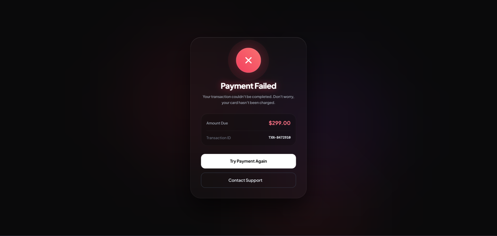

# Failed Payment UI

A premium, dark-themed payment failure state built as a static HTML page. The design focuses on a polished error experience with glassmorphism styling, soft ambient glow, a warning icon, transaction summary, and clear action buttons for retry or support.

## Overview

This project recreates a modern payment failure screen inspired by SaaS and fintech product interfaces. It includes:

- Dark luxury background
- Soft blurred gradient orbs
- Glassmorphism card layout
- Failed payment status indicator
- Transaction amount and ID summary
- Retry action and support link
- Responsive centered layout

## Tech Stack

- HTML5
- Tailwind CSS via CDN
- Google Fonts
- Vanilla JavaScript-free static layout

## Project Structure

```bash
.
├── index.html
├── README.md
└── assets (optional, if added later)
```

## Features

- Elegant failed payment messaging
- Animated glowing background effects
- Premium card design with layered transparency
- Clear CTA buttons for retry and support
- Transaction metadata presented in a structured summary block
- Mobile-friendly responsive layout

## Run Locally

Because this is a static page, there is no build step required.

1. Open the project folder.
2. Start a local web server, or simply open `index.html` in a browser.

Example with Python:

```bash
cd /workspaces/failed-payment-ui
python3 -m http.server 8000
```

Then visit:

```text
http://localhost:8000
```

## Notes

The page currently includes a support link to Stripe dashboard and a retry button styled for a premium checkout flow. It is designed as a front-end mock or production-ready UI shell for a payment failure state.

## UI



## Customization

You can easily change:

- Amount due
- Transaction ID
- Title and subtitle text
- Button labels
- Support URL
- Color palette and glow intensity

## ✨ Contact

<div align="left">
  <a href="https://webdeveloperprianka.netlify.app/" target="_blank"> 
    
  </a>
  <a href="https://www.linkedin.com/in/fatema-akther-prianka/" target="_blank">
    
  </a>
  <a href="https://stackoverflow.com/users/23182049/prianka-mimi" target="_blank">
    
  </a>
  <a href="https://leetcode.com/u/prianka-mimi/" target="_blank">
  
  </a>
    <a href="mailto:priankamimi0204@gmail.com" target="_blank">
    
  </a>
  <a href="https://discord.com/channels/@me" target="_blank">
    
  </a>